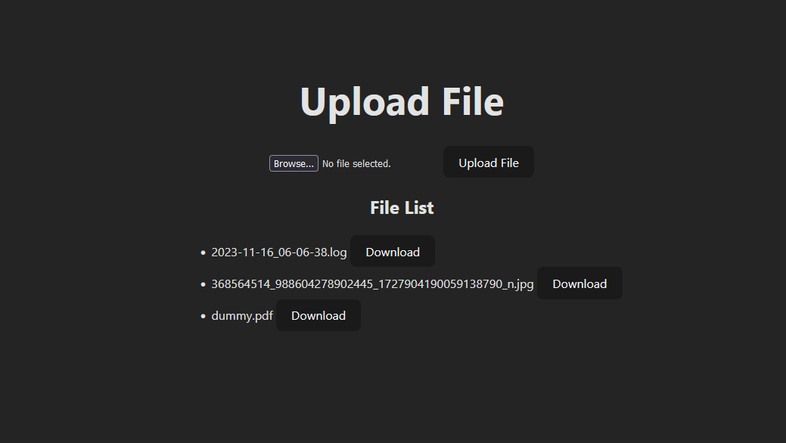

# Vue 3 + Vite + Express + MySQL

## Project Description
This is a simple project to test the integration of Vue 3, Vite, Express and MySQL.
Handling file uploads and downloads.

## Project setup

**Step 1:** Clone the repository

**Step 2:** Install the dependencies

```bash
npm install
```

**Step 3:** Query the DB
```sql
CREATE TABLE files (
  id INT AUTO_INCREMENT PRIMARY KEY,
  original_filename VARCHAR(255) NOT NULL,
  stored_filename VARCHAR(255) NOT NULL
);
```

**Step 4:** Change the database connection settings in the file `./db_config.js`


